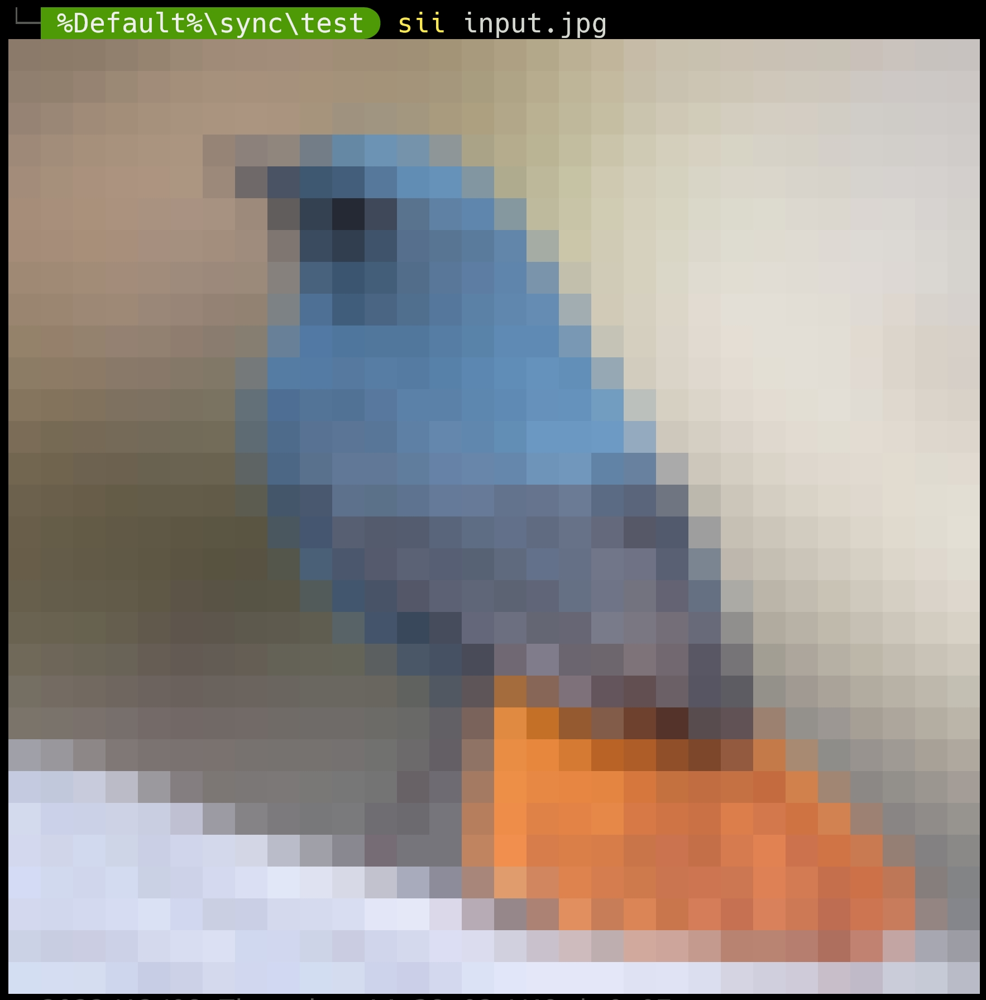

<video src='demo.mp4'>

## Note: 

- For build, tested only with GCC of Mingw-w64 v12.1.0
- For use, tested only on Windows 11 with Windows Terminal v1.15.2875.0
- Questions? Read the source, for it's short

## Build
```PowerShell
gcc main.c -o sii
```

## Example
```PowerShell
# PowerShell
sii `
input.jpg <# Input Image path #> `
50        <# Output width #>
```
```PowerShell
<#
Use PowerShell and nircmd to create 'siiX', resulting in a high resolution output.
Adjusting OUT_WIDTH_MAX in ./main.c per your display device is recommended.
nircmd: https://nircmd.nirsoft.net/sendkeypress.html
PowerShell (pwsh): https://github.com/PowerShell/PowerShell
This could be implemented with in C via 'SendInput' function, but I don't plan to do so
https://learn.microsoft.com/en-us/windows/win32/api/winuser/nf-winuser-sendinput
#>
function siiX($image_path, $delay=5, $zoomLevel=10, $sleepTime=0.5, $zoomInterval=0.05) {
  function Zoom($mode='in'){
    $zoomTime = 0
    while($zoomTime -lt $zoomLevel){
      switch($mode){
        'in'  { nircmd sendkeypress ctrl+minus }
        'out' { nircmd sendkeypress ctrl+plus }
      }
      $zoomTime = $zoomTime + 1
      Start-Sleep $zoomInterval
    }
  }
  Zoom -Mode 'in'
  Start-Sleep $sleepTime
  sii $image_path
  $UserInput = Read-Host
  Zoom -Mode 'out'
}

siiX test.jpg # <-- Try it out
```

## License
MIT

## Credits
- stb: https://github.com/nothings/stb
- test.jpg: https://unsplash.com/@linawhite
